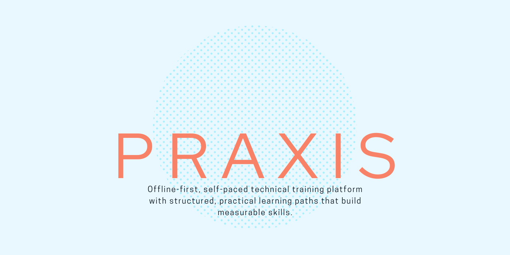

<h1>Praxis</h1>
<picture>
  <source media="(prefers-color-scheme: dark)"
          srcset="./docs/img/praxis-dark.png">
  <source media="(prefers-color-scheme: light)"
          srcset="./docs/img/praxis-light.png">
  
</picture>

 

  
  
  

<h2 id="about">🎯 About The Project</h2>
<blockquote style="border-left: 4px solid #fd2000; padding-left: 10px; color: #fafafa;">
Offline-first, self-paced technical training platform with structured, practical learning paths that build measurable skills. Connects learning to real-world job scenarios, ensuring relevant, applicable competencies aligned with the labor market real-world work scenarios, ensuring applicable and relevant skills for the job market.
</blockquote>
<h3 align="left">🧑🏽‍💻 Tech Stack</h3>

  

<h2>🏗 Project Structure</h2> 
This monorepo uses pnpm workspaces to manage multiple packages and applications:

* **apps/**: Contains the frontends (Web and Desktop/Native).
* **packages/**: Shared logic, design (UI), and domain core.
* **docs/**: Detailed architecture documentation, database schemas, and guides.

<h2>⚙️ Getting Started</h2>
<ol>
    <li>Install dependencies: `pnpm install`</li>
    <li>Run in development mode: `pnpm dev`</li>
    <li>Full documentation at: `/docs/`</li>
</ol>

---

*Made with ❤️ for the learning community.*